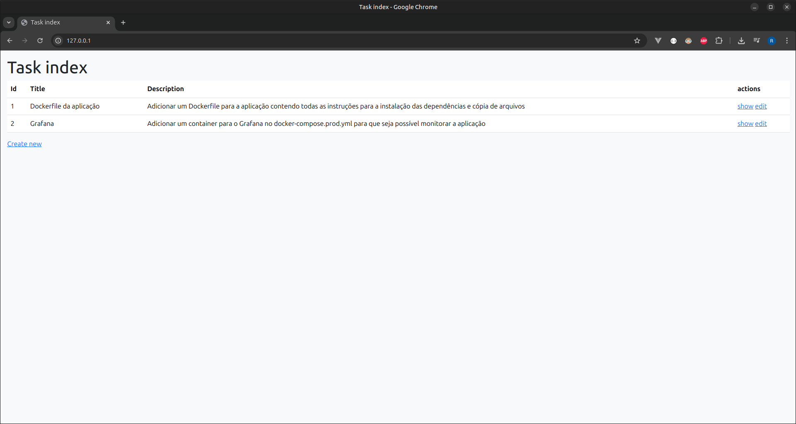
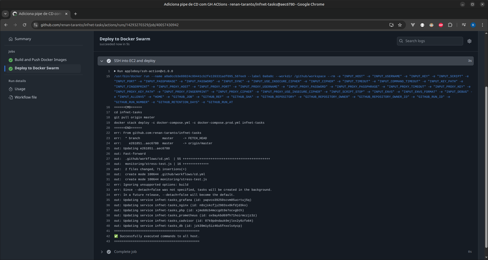

# 🐳 Infnet Tasks - Docker Swarm


Projeto desenvolvido para a disciplina "Integração Contínua, DevOps e Computação em Nuvem" do curso de pós-graduação MIT 
em Arquitetura de Software do Instituto Infnet.

A aplicação é um sistema web simples de gerenciamento de tarefas (CRUD), desenvolvido em PHP e containerizado com Docker. 
Ela é orquestrada com Docker Swarm e projetada para rodar em um ambiente distribuído com múltiplos serviços: servidor web, 
interpretador PHP, banco de dados MySQL e uma stack completa de observabilidade com Prometheus, Grafana e cAdvisor.

O projeto também inclui testes de stress com a ferramenta K6, além de uma pipeline de Continuous Deployment (CD) no GitHub Actions, 
que realiza o build das imagens, publica no Docker Hub e executa o deploy automático em um cluster Docker Swarm hospedado na AWS EC2.

---

## 🔗 Links Importantes

📦 Repositório no GitHub:
https://github.com/renan-taranto/infnet-tasks

🐳 Repositório no Docker Hub:
https://hub.docker.com/repositories/renantaranto

---

## 🧩 Arquitetura dos Serviços

A aplicação é composta pelos seguintes serviços:

| Serviço     | Função                                                                      |
|-------------|-----------------------------------------------------------------------------|
| `nginx`     | Servidor web / proxy reverso                                                |
| `php`       | Aplicação em PHP-FPM, responsável pela lógica do sistema                    |
| `db`        | Banco de dados MySQL                                                        |
| `prometheus`| Monitoramento e coleta de métricas                                          |
| `grafana`   | Visualização gráfica das métricas coletadas                                 |
| `cadvisor`  | Exporta métricas de containers (CPU, memória, rede, etc.) para o Prometheus |

---

## ✅ Funcionalidades da Aplicação

- Listagem de tarefas
- Criação, edição e exclusão
- Interface simples via navegador

---

## 🛠 Tecnologias Utilizadas

- Docker & Docker Swarm
- PHP 8.2
- Nginx
- MySQL 8
- Prometheus
- Grafana
- cAdvisor
- K6 (testes de carga)

---

## 💻 Instalação para Desenvolvimento

1. Clone este repositório:
   ```bash
   git clone https://github.com/seu-usuario/infnet-tasks.git
   cd infnet-tasks
   ```

2. Inicie os containers:
   ```bash
   docker compose up -d
   ```

3. Execute as migrations:
    ```bash
    docker compose exec php bin/console doctrine:migrations:migrate
    ```

4. Acesse a aplicação:
    - http://127.0.0.1

    Uma tela inicial, que lista as tarefas cadastradas, será exibida:
    

---

## 🚢 Deploy com Docker Swarm

1. Inicie o Swarm (caso ainda não esteja rodando):
   ```bash
   docker swarm init
   ```

    O comando para adicionar `workers` será exibido na tela. Após adicioná-los, é possível ver os
    nós em execução com o comando `docker node ls`:
    .png)

    Para esse projeto, 4 instâncias EC2 da AWS foram utilizadas:
    

2. Faça o deploy da stack:
   ```bash
   docker stack deploy -c docker-compose.yml -c docker-compose.prod.yml infnet-tasks
   ```

3. Verifique os serviços:
   ```bash
   docker service ls
   ```

    

---

## 🔁 Pipeline no Github Actions

Para fazer o deploy da aplicação, uma pipeline foi criada no Github Actions. Ela faz
o build das imagens, envia elas para o Docker Hub (push), acessa o EC2 e executa o deploy. O código
relacionado pode ser visto [aqui](https://github.com/renan-taranto/infnet-tasks/blob/master/.github/workflows/cd.yml).


---

## 📦 Imagens hospedadas no Docker Hub

O Docker Hub é usado para hospedar as imagens


---

## 🩺 Health check

Para a realização do "health check", o `HealthCheckController.php` foi criado para responder as 
requisições na url `/ping`. E o seguinte healthcheck foi adicionado no serviço do nginx de produção:
```yaml
        healthcheck:
            test: [ "CMD", "curl", "-f", "http://localhost/ping" ]
            interval: 10s
            timeout: 3s
            retries: 3
            start_period: 5s
```

É possível ver o resultado dele em execução na imagem a seguir:


---

## 📊 Observabilidade com Grafana

- Acesse o Grafana:
  ```
  http://IP_DO_HOST:3000
  ```
- Login padrão:
    - **Usuário:** `admin`
    - **Senha:** `admin` (ou conforme configurado)
- Dashboards pré-configurados mostram uso de CPU, memória, containers ativos e muito mais.


---

## 🔥 Teste de Stress com K6

Um script de stress test com o [K6](https://k6.io/) está disponível no diretório `/monitoring`.

### Para executar:

1. Edite o host alvo dentro do arquivo `stress-test.js`;
2. Execute o teste:
   ```bash
   k6 run monitoring/stress-test.js
   ```
O output será como o da seguinte imagem:


Na imagem a seguir vemos os recursos sendo consumidos em maior quantidade durante o teste:


E aqui vemos o dashboard do período que vem antes, durante e depois do teste:


---

## 👨‍💻 Autor

[Renan Taranto](https://github.com/renan-taranto)